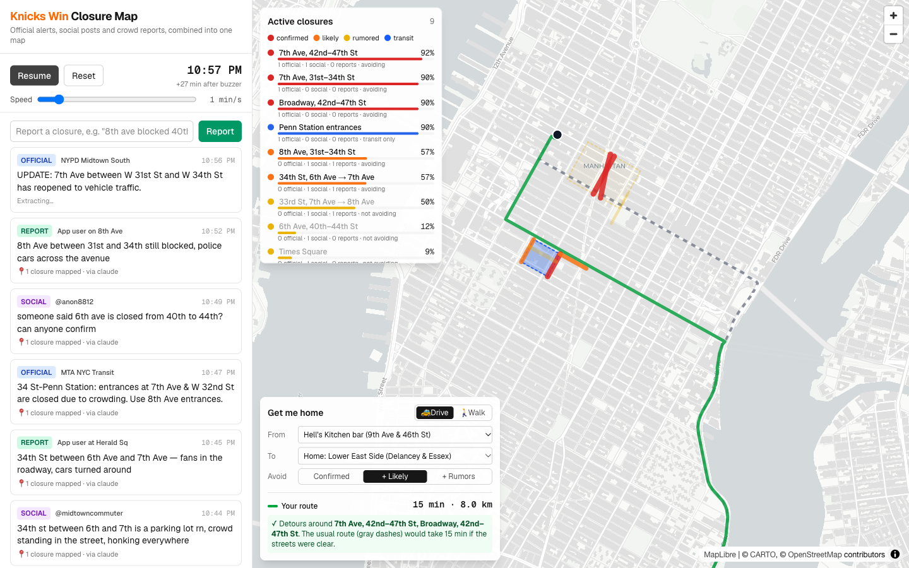

# Knicks Win Closure Map

**Live demo:** https://knicks-closure-map.vercel.app



PMAI NYC, Challenge 2. Official alerts, social posts and crowd reports go in; you get a live map of street closures with a confidence score for each, plus a route home that avoids them.

```
Feed (official / social / report) → Claude extraction → geocode onto street grid
   → fuse + confidence score → MapLibre map → Valhalla routing that avoids closures
```

## Run

```bash
cp .env.example .env.local   # add OPENROUTER_API_KEY (optional)
npm install
npm run dev                  # http://localhost:3000
```

Press **Plan route** (default: Hell's Kitchen bar → Lower East Side, driving), then **Start replay**.
At about 10:42 PM, NYC DOT confirms the Times Square closures. Your route then re-plans by itself around them,
and the old route stays on the map as a dashed line.

## How it works

| File | What it does |
| --- | --- |
| `src/lib/scenario.ts` | Scripted championship night: 14 timed events, including a rumor, corroborating posts and a reopening |
| `src/lib/extract.ts` | Claude via OpenRouter (`anthropic/claude-opus-5.5`, JSON-schema structured output) turns free text into closure claims: street, cross streets, place, mode, hearsay or stated |
| `src/lib/jev.ts` | Optional Jev (TypeSafe System One) triage before Claude, about 100 ms. Two yes/no probabilities per post: does it report a closure (non-official posts under 20% skip Claude), and is it first-hand or hearsay (replaces the fixed ×0.4 hearsay penalty in fusion). Needs `TYPESAFE_API_KEY`; without a key, or if the call fails, the app works as before |
| `src/lib/heuristic.ts` | Regex fallback used when there's no API key or the call fails |
| `src/lib/grid.ts` | Offline Manhattan grid model plus named places, which turns claims into lines and avoid-polygons |
| `src/lib/fuse.ts` | Groups claims by segment and scores them with noisy-OR: official 0.9, crowd report 0.5, social 0.35, hearsay ×0.4. Unofficial reports decay over time; an official "reopened" clears the closure |
| `src/app/api/route` | Valhalla `exclude_polygons`, run once as a baseline and once with closures avoided |
| `src/components/Dashboard.tsx` | Replay clock, live feed, "Report a closure" box, closure list, route planner |

Tiers: **confirmed** ≥ 85%, **likely** ≥ 50%, **rumored** below that. The planner avoids every closure at or above the slider threshold.
Driving avoids `vehicles` and `all` closures. Walking avoids `pedestrians` and `all`. Transit notices are shown but don't change routes.

## Next steps (real data)

- **Official:** NYC511 events, NYC DOT weekly advisories, Notify NYC, NYC Open Data street-closure and SAPO event permits, MTA GTFS-rt alerts
- **Social:** Bluesky firehose (open), Reddit r/nyc and r/NYKnicks, X if you have API access
- **Geocoding:** swap `grid.ts` for NYC LION centerlines or NYC GeoSearch (`geosearch.planninglabs.nyc`)
- **Clustering:** merge overlapping geometries spatially instead of by exact segment key
- **Routing:** self-host Valhalla (Docker) and add transit routing via MTA GTFS
